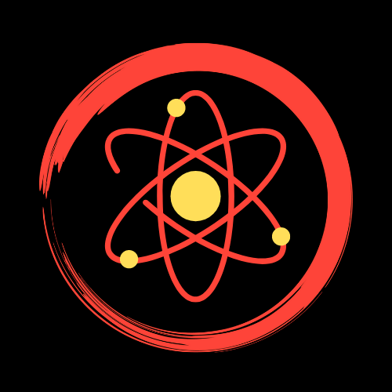

# Atom Query ⚛️

**Atom Query** is a **Discord Bot** that able to calculate common queries. [Invite here](https://discord.com/oauth2/authorize?client_id=881526346411556865&permissions=534723947584&scope=bot%20applications.commands).
This bot are able to calculate **area of a trampezium**, find the **intersection of two set**, and much more!



# Requirements 📝

In order for this Discord Bot to work properly and to avoid error from popping out in the terminal, use `pip` to install the listed dependencies on [requirements.txt](requirements.txt) using the command below :

```
pip install -r requirements.txt
```

I've also used 5 built-in Python library in this project which is `math`, `json`, `os`, `typing` and `cmath`.

# LICENSE

MIT License

Copyright (c) 2021 Daniesh Rieza

Permission is hereby granted, free of charge, to any person obtaining a copy
of this software and associated documentation files (the "Software"), to deal
in the Software without restriction, including without limitation the rights
to use, copy, modify, merge, publish, distribute, sublicense, and/or sell
copies of the Software, and to permit persons to whom the Software is
furnished to do so, subject to the following conditions:

The above copyright notice and this permission notice shall be included in all
copies or substantial portions of the Software.

THE SOFTWARE IS PROVIDED "AS IS", WITHOUT WARRANTY OF ANY KIND, EXPRESS OR
IMPLIED, INCLUDING BUT NOT LIMITED TO THE WARRANTIES OF MERCHANTABILITY,
FITNESS FOR A PARTICULAR PURPOSE AND NONINFRINGEMENT. IN NO EVENT SHALL THE
AUTHORS OR COPYRIGHT HOLDERS BE LIABLE FOR ANY CLAIM, DAMAGES OR OTHER
LIABILITY, WHETHER IN AN ACTION OF CONTRACT, TORT OR OTHERWISE, ARISING FROM,
OUT OF OR IN CONNECTION WITH THE SOFTWARE OR THE USE OR OTHER DEALINGS IN THE
SOFTWARE.

# And finally, thanks to everyone who have cloned the repository.

This been a long project for me but this not the end of the project. More and more changes are coming on **Atom Query** in days, weeks, months or even years. Thanks to everyone who's reading this notes. 🎉
